# TRAIN-TICKET-MICROSERVICE-APPLICATION-PROJECT

The Train Station Application is a comprehensive microservices-based application that has been meticulously crafted using a variety of programming languages, including Java, Go, Python, and Node.js. This project is designed to serve as a real-world demonstration of the critical role that DevOps plays in a production environment. Throughout the development of this application, core DevOps principles such as automation, infrastructure management etc.have been implemented to showcase their practical application and value.

## Technologies:
Terraform,Github Actions,Docker,Node.js,AZURE,AKS,MONGODB,MYSQL

## Key Project Elements
1. **Microservices Architecture**: The Train Station Application is built as a collection of microservices, fostering flexibility and scalability.

2. **Continuous Integration and Continuous Deployment (CI/CD)**: GitHub Actions, a robust CI/CD platform, has been used to automate the build, test, and deployment processes. This approach enables the rapid delivery of code changes while maintaining quality and stability.

3. **Infrastructure as Code (IaC)**: Terraform scripts provision the essential infrastructure components on the Azure cloud platform, including Azure Kubernetes Cluster, Azure container registry, MySQL, and Postgres databases. IaC ensures consistency and efficiency.

4. **Database Management**:  MySQL and Mongodb are integrated into the application to demonstrate the management of different database systems within the DevOps framework.

5. **Kubernetes Deployment**: The Train Station Application is deployed using Kubernetes. Manifest files define the desired state of the application, enabling efficient container orchestration and management in a containerized environment.

## Tasks:
1. Automate Build, Test and Deploy Application as Containers to Dockerhub.
i. I ensured that my codebase was well-managed using Git and hosted on GitHub, while setting the      enivornment variables for the pipeine run.
  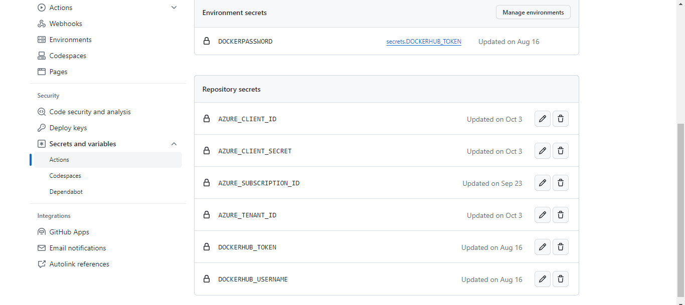
  
ii.Configuring the CI pipeline in GitHub Actions, I orchestrated the execution of build scripts and   the creation of Docker images automatically using dockerfile to containerise the applications. 
  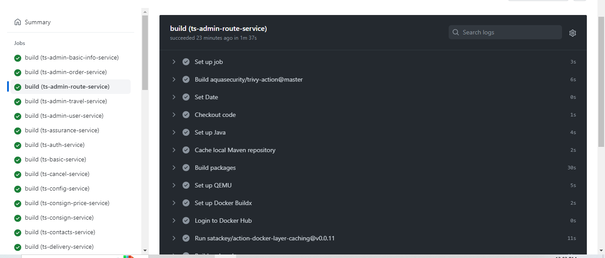

  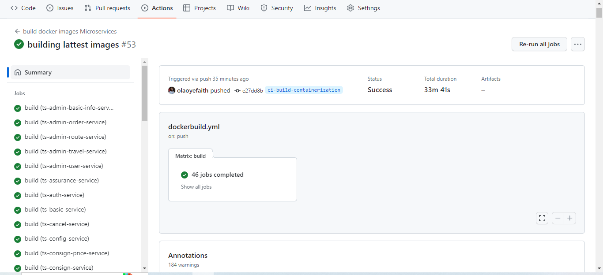

iii. For centralized container management, I leveraged DockerHub as my container registry, making it a repository for my Docker images.
  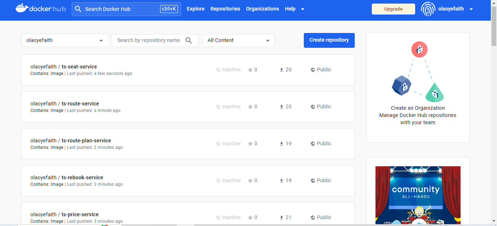
 
Code sample
```
 - name: Set up Java
        uses: actions/setup-java@v2
        with:
          distribution: 'adopt'
          java-version: '8'

      - name: Cache local Maven repository
        uses: actions/cache@v2
        with:
          path: ~/.m2/repository
          key: ${{ runner.os }}-maven-${{ hashFiles('**/pom.xml') }}
          restore-keys: |
            ${{ runner.os }}-maven-

      - name: Build packages
        run: mvn clean package -Dmaven.test.skip=true
                   
      - name: Set up QEMU
        uses: docker/setup-qemu-action@v2
      
      - name: Set up Docker Buildx
        uses: docker/setup-buildx-action@v2
      
      - name: Login to Docker Hub
        uses: docker/login-action@v2
        with:
          username: ${{ secrets.DOCKERHUB_USERNAME }}
          password: ${{ secrets.DOCKERHUB_TOKEN }}

      - uses: satackey/action-docker-layer-caching@v0.0.11
        continue-on-error: true

      - name: Build and push
        uses: docker/build-push-action@v4
        with:
          context: ./${{ matrix.module}}
          push: true
          tags: ${{ secrets.DOCKERHUB_USERNAME }}/${{ matrix.module }}:${{ env.IMAGE_TAG }}
       
      - name: Run Trivy vulnerability scanner
        uses: aquasecurity/trivy-action@master
        continue-on-error: true
        with:
         image-ref: 'docker.io/ ${{ secrets.DOCKERHUB_USERNAME }}/${{ matrix.module }}:${{ env.IMAGE_TAG }}'
         format: 'table'
         exit-code: '1'
         ignore-unfixed: true
         vuln-type: 'os,library'
         severity: 'MEDIUM,HIGH,CRITICAL'
```
Docker
 Directory: .github/workflows/dockerbuild.yml


2. Write Terraform Configurations For deployment eg AKS and Set Backend to AZURE.

The primary goal was to leverage Infrastructure as Code (IaC) principles to define the AKS infrastructure and store the Terraform state in an Azure Backend, ensuring a secure and collaborative approach to managing the infrastructure's lifecycle.

i. I implemented authentication using OpenID Connect (OIDC) within GitHub Actions and Utilized OIDC tokens to authenticate and authorize Terraform operations.
 

ii. The next step was to enable GitHub Actions to dynamically configure Azure Storage settings for Terraform backend.
 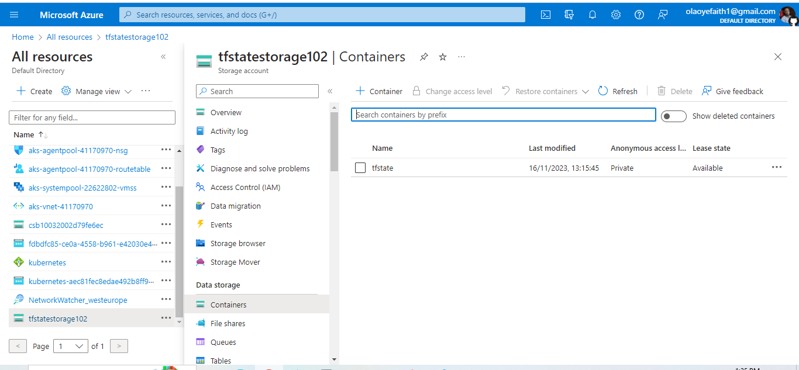


 Directory: infra/
 ```
 resource "azurerm_kubernetes_cluster" "k8s" {
  name                = var.cluster_name
  location            = azurerm_resource_group.rg.location
  resource_group_name = azurerm_resource_group.rg.name
  dns_prefix          = var.dns_prefix
  kubernetes_version  = var.kubernetes_version

  default_node_pool {
    name       = "systempool"
    node_count = var.node_count
    vm_size    = "Standard_D4_v2"
  }

  identity {
    type = "SystemAssigned"
  }

  network_profile {
    network_plugin = "kubenet"
    network_policy = "calico"
  }

  tags = {
    Environment = "Development"
  }
}


 
 ```

3. Automate Infrastructure Provisioning Using Github Actions While Ensuring Sensitive data Protection by Using Environment Variable.

i. Defined a deployment workflow in GitHub Actions to automate the execution of Terraform commands 
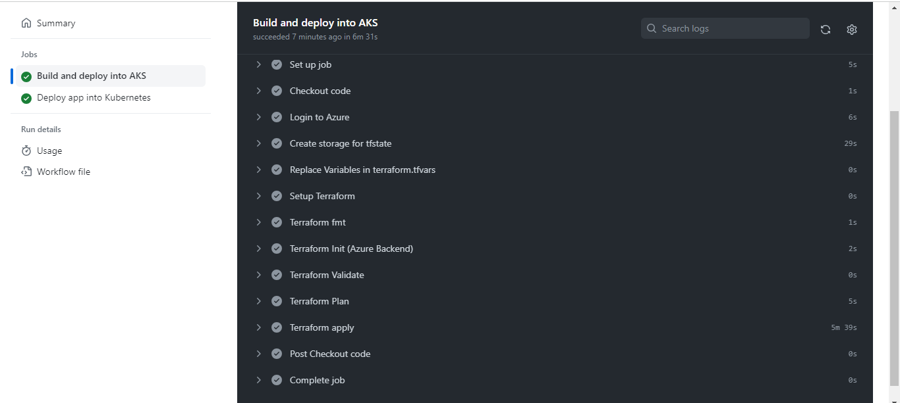

ii. Orchestrated the deployment process, including initialization, planning, and applying changes.
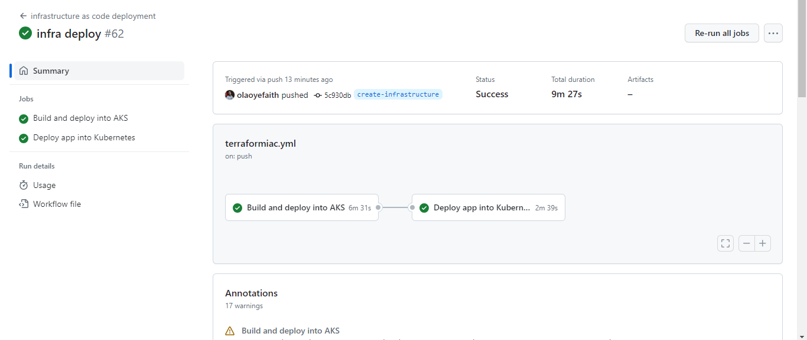


code sample
```
  name: Build and deploy into AKS
    runs-on: ubuntu-latest
    steps:
      - name: Checkout code
        uses: actions/checkout@v2
      - name: Login to Azure
        uses: azure/login@v1
        with:
          client-id: ${{ secrets.AZURE_CLIENT_ID }}
          tenant-id: ${{ secrets.AZURE_TENANT_ID }}
          subscription-id: ${{ secrets.AZURE_SUBSCRIPTION_ID }}
  
      - name: Create storage for tfstate
        uses: azure/CLI@v1
        with:
          azcliversion: 2.35.0
          inlineScript: |
            # Create the resource group
            az group create -n $INFRA_RESOURCE_GROUP -l $LOCATION

            # Create the storage account
            az storage account create -g $INFRA_RESOURCE_GROUP -l $LOCATION \
              --name $TF_STATE_STORAGE_ACCOUNT_NAME \
              --sku Standard_LRS \
              --encryption-services blob

            # Retrieve the storage account key
            ACCOUNT_KEY=$(az storage account keys list --resource-group $INFRA_RESOURCE_GROUP --account-name $TF_STATE_STORAGE_ACCOUNT_NAME --query [0].value -o tsv)

            # Create a storage container (for the Terraform State)
            az storage container create --name $TF_STATE_CONTAINER_NAME --account-name $TF_STATE_STORAGE_ACCOUNT_NAME --account-key $ACCOUNT_KEY

            echo "TF_STATE_ACCESS_KEY=$ACCOUNT_KEY" >> $GITHUB_ENV
      - name: Replace Variables in terraform.tfvars
        uses: datamonsters/replace-action@v2
        with:
          files: infra/terraform.tfvars
          replacements: |
            __AKS_RESOURCE_GROUP__=${{ env.AKS_RESOURCE_GROUP}},__AKS_NAME__=${{ env.AKS_NAME}},__CLIENT_ID__=${{ secrets.AZURE_CLIENT_ID }},__CLIENT_SECRET__= ${{ secrets.AZURE_CLIENT_SECRET }},__SUBSCRIPTION_ID__=${{ secrets.AZURE_SUBSCRIPTION_ID }} ,__TENANT_ID__=${{ secrets.AZURE_TENANT_ID }}
          

      - name: Setup Terraform
        uses: hashicorp/setup-terraform@v1
        with:
          terraform_version: 1.1.7
      - name: Terraform fmt
        id: fmt
        run: terraform fmt
        working-directory: infra
        continue-on-error: true

      - name: Terraform Init (Azure Backend)
        id: init
        run: terraform init 
          -backend-config="storage_account_name=$TF_STATE_STORAGE_ACCOUNT_NAME"
          -backend-config="container_name=$TF_STATE_CONTAINER_NAME"
          -backend-config="access_key=$TF_STATE_ACCESS_KEY" 
          -backend-config="key=$TF_STATE_FILE_NAME"
        env:
          ARM_CLIENT_ID: ${{ secrets.AZURE_CLIENT_ID }}
          ARM_SUBSCRIPTION_ID: ${{ secrets.AZURE_SUBSCRIPTION_ID }}
          ARM_TENANT_ID: ${{ secrets.AZURE_TENANT_ID }}
          ARM_USE_OIDC: true
        working-directory: infra/

      - name: Terraform Validate
        run: terraform validate -no-color
        working-directory: infra
        
      - name: Terraform Plan
        id: plan
        env:
          ARM_CLIENT_ID: ${{ secrets.AZURE_CLIENT_ID }}
          ARM_SUBSCRIPTION_ID: ${{ secrets.AZURE_SUBSCRIPTION_ID }}
          ARM_TENANT_ID: ${{ secrets.AZURE_TENANT_ID }}
          ARM_USE_OIDC: true
        run: terraform plan -var-file="terraform.tfvars"
        working-directory: infra
        continue-on-error: true
        
      # - name: Terraform apply
      #   run: terraform apply -auto-approve
      #   working-directory: infra
      #   env:
      #    ARM_CLIENT_ID: ${{ secrets.AZURE_CLIENT_ID }}
      #    ARM_SUBSCRIPTION_ID: ${{ secrets.AZURE_SUBSCRIPTION_ID }}
      #    ARM_TENANT_ID: ${{ secrets.AZURE_TENANT_ID }}
        #  ARM_USE_OIDC: true
 
  deploy-app-aks:
    name: Deploy app into Kubernetes
    runs-on: ubuntu-latest
    needs:
      - build-and-deploy
    steps:
      - name: Checkout code
        uses: actions/checkout@v2
    
      - name: Login to Azure
        uses: azure/login@v1
        with:
         client-id: ${{ secrets.AZURE_CLIENT_ID }}
         tenant-id: ${{ secrets.AZURE_TENANT_ID }}
         subscription-id: ${{ secrets.AZURE_SUBSCRIPTION_ID }}
      
      - uses: azure/setup-kubectl@v3
        name: Setup kubectl
      - name: Setup kubelogin
        uses: azure/use-kubelogin@v1
        with:
          kubelogin-version: 'v0.0.26'

      - name: Connect to AKS
        uses: Azure/aks-set-context@v3
        with:
          cluster-name: ${{ env.AKS_NAME }}
          resource-group: ${{ env.AKS_RESOURCE_GROUP }}
          admin: 'false'
          use-kubelogin: 'true'


      - name: Install helm
        run: |
          curl -fsSL -o get_helm.sh https://raw.githubusercontent.com/helm/helm/main/scripts/get-helm-3
          chmod 700 get_helm.sh
          ./get_helm.sh
          helm repo add grafana https://grafana.github.io/helm-charts
          helm repo add stable https://charts.helm.sh/stable
      - name: Install Kube-prometheus-stack
        run: |
          helm repo add prometheus-community https://prometheus-community.github.io/helm-charts
          helm repo update
          helm upgrade --force -i kube-prometheus-stack prometheus-community/kube-prometheus-stack \
            --namespace monitoring --create-namespace --timeout 20m30s
      - name: Install Cert Manager
        run: |
          helm repo add jetstack https://charts.jetstack.io
          helm upgrade --force -i cert-manager jetstack/cert-manager \
            --namespace cert-manager --create-namespace \
            --version v1.11.0 \
            --set installCRDs=true --timeout 20m30s
      - name: Install Nginx Controller
        run: |
          helm repo add nginx-stable https://helm.nginx.com/stable
          helm repo update
          helm upgrade --force -i ingress-nginx ingress-nginx \
            --repo https://kubernetes.github.io/ingress-nginx \
            --namespace ingress-nginx --create-namespace \
            --set controller.metrics.enabled=true --timeout 20m30s
          kubectl get services -n ingress-nginx

      - name: Deploy Yaml manifest for train application
        working-directory: ./deployment
        run: |
            kubectl apply -f database.yml
            kubectl apply -f backends.yml
            kubectl apply -f frontend.yml
            kubectl apply -f ingress.yml
            
```
 Directory: .github/workflows/terraformiac.yml

4. Write Manifest Files to deploy K8s including deployment,service,statefulset and ingress etc.

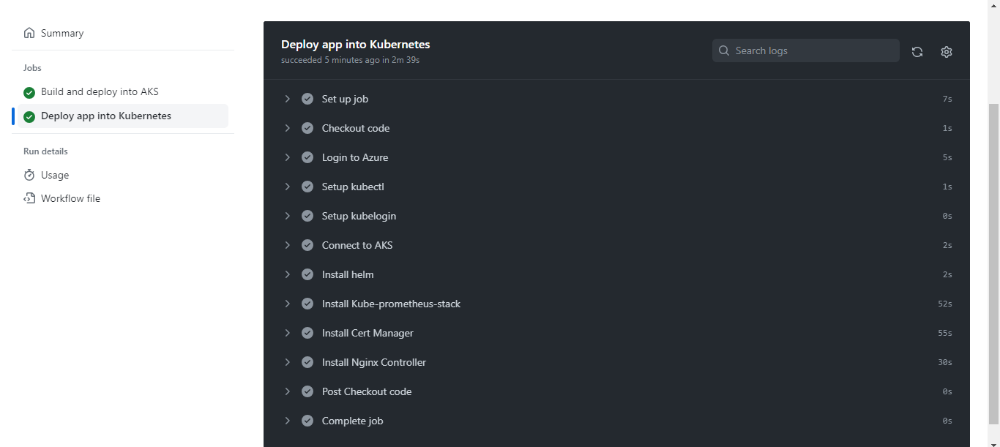

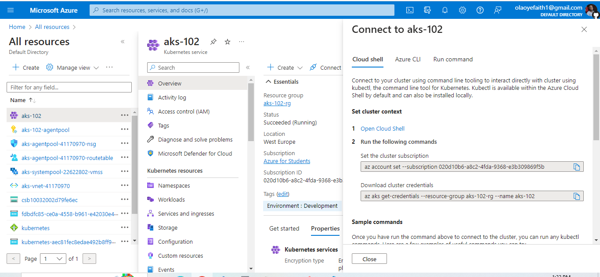

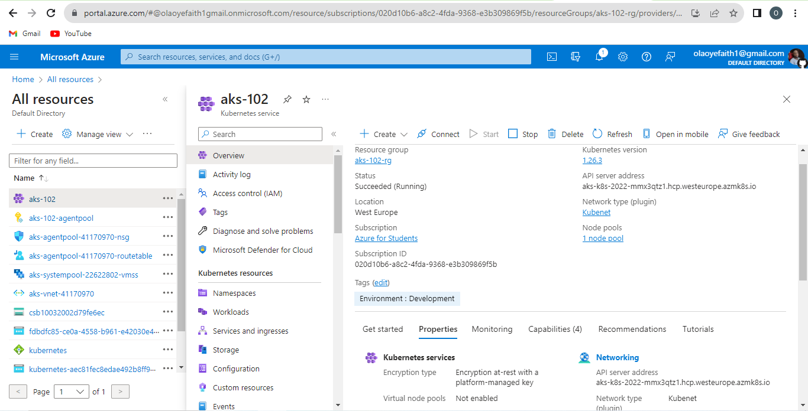

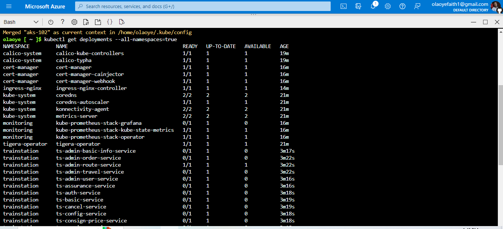


```
---
apiVersion: v1
kind: Namespace
metadata:
  name: trainstation
---
apiVersion: apps/v1
kind: Deployment
metadata:
  name: ts-admin-basic-info-service
  namespace: trainstation
spec:
  selector:
    matchLabels:
      app: ts-admin-basic-info-service
  replicas: 1
  template:
    metadata:
      labels:
        app: ts-admin-basic-info-service
    spec:
      containers:
      - name: ts-admin-basic-info-service
        image: olaoyefaith/ts-admin-basic-info-service:20231009174357
        imagePullPolicy: Always
        ports:
        - containerPort: 18767
        resources:
          requests:
            cpu: 50m
            memory: 100Mi
          limits:
            cpu: 200m
            memory: 500Mi
        readinessProbe:
          tcpSocket:
            port: 18767
          initialDelaySeconds: 160
          periodSeconds: 10
          timeoutSeconds: 5   
---


```

  Directory: deployment/


## Overall Objective:

The primary goal of the Train Station Application project is to provide a tangible representation of how DevOps practices can enhance the software development and deployment process. By emphasizing automation, infrastructure management through IaC and Kubernetes for container orchestration the project illustrates how DevOps practices can lead to greater efficiency, faster delivery, and higher quality software products in a real-world, production-based setting.
